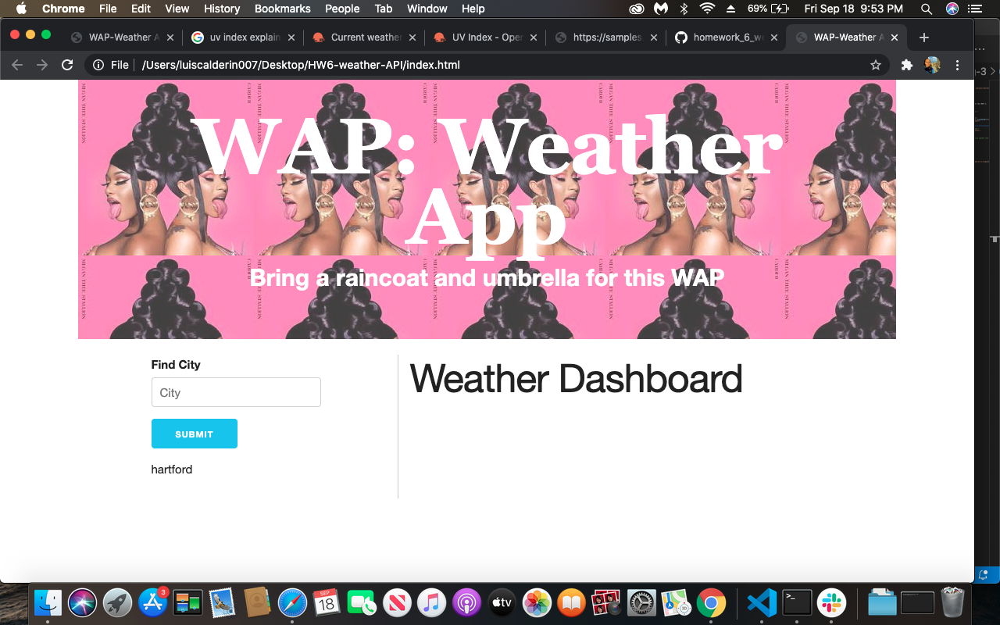
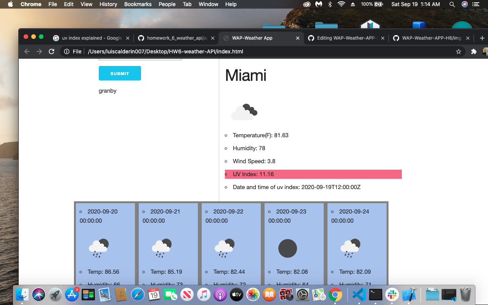

# The WAP: Weather App

## Overview

Rain or shine, hail or thunder, this weather app has exactly what you need to stay up to date on weather conditions. When the page first loads there will be an input field where you can type any city you like. Make sure spelling is corect otherwise the page won't load. After submitting (via pressing enter or clicking the submit button) you will have the right column populate  with different weather information for the current date and time.  The five day forecast for your chosen city is immediately displayed at the footer of the page. The uv index div will change color from green, orange, and red. This is directly proportional to the risk level. The date and time of the uv measurement is displayed right below it. This app contains information such as temperature, humidity, wind speed, and more. Don't forget to bring a bucket and a mop... I mean a raincoat and umbrella for this WAP.

## Links
[github page](https://github.com/lcalderin12/WAP-Weather-APP-H6)

## Screenshots

